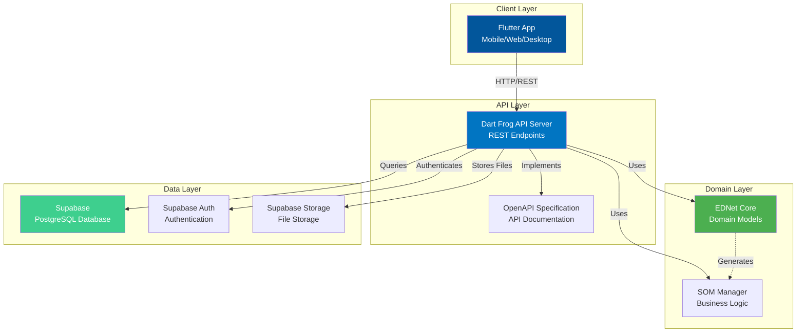

# SOM - Smart Offer Management

<div align="center">


**B2B Marketplace Platform Connecting Buyers with Providers**

[](https://flutter.dev)
[](https://dart.dev)
[](LICENSE)
[](https://dartfrog.vgv.dev)
[](https://supabase.com)

[Features](#features) • [Architecture](#architecture) • [Getting Started](#getting-started) • [Documentation](#documentation)

</div>

---

## Overview

**SOM (Smart Offer Management)** is a comprehensive B2B marketplace platform that streamlines the process of business inquiry and offer management. The platform connects buyers seeking products or services with qualified providers, enabling efficient communication, offer submission, and business relationship management.

Built with Flutter for cross-platform deployment (mobile, web, desktop) and powered by a robust Dart Frog API backend with Supabase database, SOM delivers enterprise-grade features with a modern, responsive user experience.

### Screenshots

> *Screenshots coming soon*

---

## Features

### Core Functionality

- ✅ **Inquiry Management**
  - Create and manage business inquiries with detailed specifications
  - Attach documents, images, and supporting materials
  - Set delivery locations, deadlines, and provider criteria
  - Track inquiry status throughout lifecycle (Draft, Published, Closed, Expired)
  - Filter and search inquiries by category, branch, and date range

- ✅ **Offer Management**
  - Providers respond to inquiries with competitive offers
  - Detailed offer descriptions with pricing and delivery terms
  - Attachment support for proposals and documentation
  - Offer comparison and evaluation tools
  - Status tracking (Submitted, Under Review, Accepted, Rejected)

- ✅ **User & Company Management**
  - Multi-role support: Buyer, Provider, Consultant
  - Company profiles with detailed business information
  - User authentication and authorization (Supabase Auth)
  - Company verification and credential management
  - Branch and location management

- ✅ **Subscription Management**
  - Tiered subscription plans: Standard, Premium, Enterprise
  - Feature access control based on subscription tier
  - Payment integration and billing management
  - Subscription analytics and usage tracking

- ✅ **Statistics & Analytics**
  - Dashboard with key performance metrics
  - Inquiry and offer analytics
  - Provider performance tracking
  - Market insights and trends

- ✅ **Ads Management**
  - Banner and promotional content management
  - Targeted advertising by category and branch
  - Ad performance analytics
  - Campaign scheduling and budgeting

- ✅ **Multi-language Support**
  - German (de)
  - English (en)
  - Serbian (sr)
  - Localized UI and content

---

## Architecture

SOM follows a **Domain-Driven Design (DDD)** approach with clean architecture principles, leveraging the **EDNet Core** framework for domain modeling and event-driven design.

### High-Level Architecture



### Technology Stack

**Frontend**
- **Flutter 3.8+** - Cross-platform UI framework
- **Dart 3.8+** - Programming language
- **MobX** - State management
- **Beamer** - Navigation and routing
- **Chopper** - HTTP client and API integration
- **Supabase Flutter SDK** - Database and auth integration

**Backend**
- **Dart Frog 1.1.0** - Minimalist API framework
- **Supabase** - Backend-as-a-Service (PostgreSQL, Auth, Storage)
- **JWT** - Authentication tokens
- **EDNet Core** - Domain modeling framework

**Domain Modeling**
- **EDNet Core** - Event-driven domain modeling
- **YAML DSL** - Domain model definitions
- **Code Generation** - Automated model generation

**Development Tools**
- **build_runner** - Code generation
- **json_serializable** - JSON serialization
- **flutter_lints** - Code quality
- **OpenAPI** - API documentation

---

## Getting Started

### Prerequisites

- **Flutter SDK** 3.8.0 or higher
- **Dart SDK** 3.8.0 or higher
- **Supabase Account** (for database and authentication)
- **Git** for version control

### Installation

1. **Clone the repository**
   ```bash
   git clone <repository-url>
   cd som-app
   ```

2. **Install dependencies**
   ```bash
   flutter pub get
   ```

3. **Install API dependencies**
   ```bash
   cd api
   dart pub get
   cd ..
   ```

4. **Configure environment**

   Create a `.env` file in the project root with your Supabase credentials:
   ```env
   SUPABASE_URL=your_supabase_project_url
   SUPABASE_ANON_KEY=your_supabase_anon_key
   ```

5. **Generate code**
   ```bash
   flutter pub run build_runner build --delete-conflicting-outputs
   ```

### Running the Application

**Flutter App (Development)**
```bash
# Run on connected device/emulator
flutter run

# Run on specific platform
flutter run -d chrome        # Web
flutter run -d macos          # macOS
flutter run -d android        # Android
flutter run -d ios            # iOS
```

**API Server (Development)**
```bash
cd api
dart_frog dev
```

The API will be available at `http://localhost:8080`

### Building for Production

**Flutter App**
```bash
# Web
flutter build web

# Android APK
flutter build apk --release

# iOS (requires macOS and Xcode)
flutter build ios --release

# macOS
flutter build macos --release
```

**API Server**
```bash
cd api
dart_frog build
```

---

## Development

### Project Structure

```
som-app/
├── api/                          # Dart Frog API backend
│   ├── routes/                   # API route handlers
│   ├── lib/                      # Shared API logic
│   └── pubspec.yaml
├── lib/
│   ├── domain/                   # Domain layer
│   │   ├── model/                # Domain models
│   │   └── infrastructure/       # Repositories, services
│   ├── ui/                       # Presentation layer
│   │   ├── pages/                # Application pages
│   │   ├── widgets/              # Reusable widgets
│   │   ├── routes/               # Navigation
│   │   └── theme/                # Theming
│   ├── generated/                # Generated code (EDNet models)
│   └── requirements/             # EDNet YAML definitions
├── assets/                       # Images, fonts, resources
├── images/                       # Application images
├── lang/                         # i18n translations
├── openapi/                      # OpenAPI specification
├── seed-data/                    # Database seed data
└── pubspec.yaml
```

### Running Tests

```bash
# Run all tests
flutter test

# Run specific test file
flutter test test/path/to/test_file.dart

# Run tests with coverage
flutter test --coverage
```

### Code Generation

The project uses code generation for various purposes:

```bash
# Generate all code
flutter pub run build_runner build --delete-conflicting-outputs

# Watch mode (regenerate on file changes)
flutter pub run build_runner watch

# Generate EDNet domain models
cd lib/generated
flutter pub get
flutter pub run build_runner build --delete-conflicting-outputs
```

### Linting and Formatting

```bash
# Analyze code
flutter analyze

# Format code
dart format .

# Fix auto-fixable issues
dart fix --apply
```

---

## API Documentation

The API is documented using OpenAPI specification. Access the documentation:

- **Local Development**: `http://localhost:8080/docs` (when API server is running)
- **OpenAPI Spec**: See `/api/openapi.yaml`

### Key API Endpoints

- `POST /auth/login` - User authentication
- `POST /auth/register` - User registration
- `GET /inquiries` - List inquiries
- `POST /inquiries` - Create inquiry
- `GET /offers` - List offers
- `POST /offers` - Submit offer
- `GET /companies` - List companies
- `GET /statistics` - Platform statistics

For complete API documentation, refer to the OpenAPI specification.

---

## Documentation

- **[Architecture Guide](docs/ARCHITECTURE.md)** - Detailed architecture documentation
- **[Features Documentation](docs/FEATURES.md)** - Comprehensive feature descriptions
- **[Deployment Guide](docs/DEPLOYMENT.md)** - Production deployment instructions
- **[Contributing Guidelines](CONTRIBUTING.md)** - How to contribute to the project
- **[Security Policy](SECURITY.md)** - Security guidelines and vulnerability reporting

---

## EDNet Core Integration

SOM leverages **EDNet Core**, a domain modeling framework that enables:

- **Event-Driven Design** - Domain events and event sourcing
- **YAML-based Domain Modeling** - Define domain models declaratively
- **Code Generation** - Automated generation of domain classes
- **Type Safety** - Compile-time validation of domain constraints
- **Business Rule Enforcement** - Domain invariants and validation

Domain models are defined in `lib/requirements/offer/management.ednet.yaml` and generated code resides in `lib/generated/`.

---

## License

**Proprietary Software**

This software is proprietary and confidential. Unauthorized copying, distribution, or use of this software, via any medium, is strictly prohibited.

Copyright © 2026 SOM. All rights reserved.

---

## Contact & Support

For questions, issues, or support requests:

- **Email**: support@som-platform.com
- **Issue Tracker**: [GitHub Issues](../../issues)
- **Documentation**: [Project Wiki](../../wiki)

---

<div align="center">

**Built with ❤️ using Flutter, Dart Frog, and EDNet Core**

</div>
