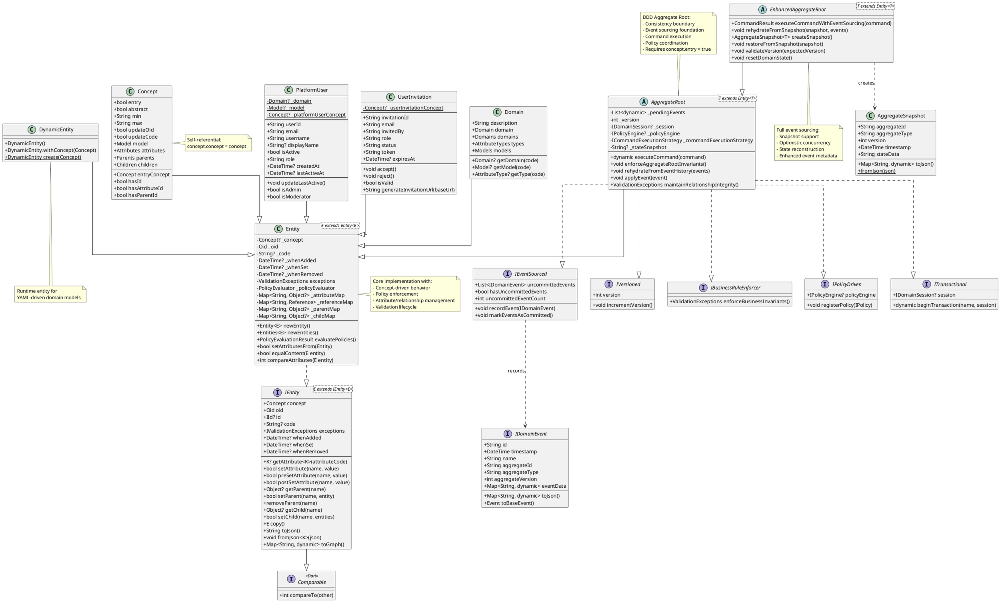

# Entity Abstraction Hierarchy - EDNet Core

**Date:** 2025-10-04
**Purpose:** Complete architectural map of the Entity hierarchy in ednet_core
**Scope:** Interface chains, implementation classes, contracts, and architectural coherence

---

## Executive Summary

The EDNet Core Entity hierarchy implements a sophisticated Domain-Driven Design (DDD) architecture with clear separation of concerns through SOLID interfaces. The hierarchy flows from a generic `IEntity` interface through progressively specialized implementations, culminating in event-sourced aggregate roots.

**Key Findings:**
- **Coherent Architecture**: Clear interface contracts with proper implementation
- **SOLID Compliance**: Aggregate roots implement focused interfaces (IEventSourced, IVersioned, etc.)
- **Progressive Specialization**: Entity → AggregateRoot → EnhancedAggregateRoot
- **Type Safety**: Self-referential type parameters ensure compile-time safety
- **Runtime Flexibility**: DynamicEntity allows YAML-driven domain models

---

## 1. Interface Chain

### 1.1 IEntity<E extends IEntity<E>> - Root Interface

**Location:** `/Users/slavisam/projects/cms/packages/core/lib/domain/model/entity/interfaces/i_entity.dart:68`

**Purpose:** Defines the fundamental contract for all domain entities in the system.

**Core Contracts:**
```dart
abstract class IEntity<E extends IEntity<E>> implements Comparable {
  // Identity & Metadata
  Concept get concept;                    // Domain metadata descriptor
  Oid get oid;                           // Unique object identifier
  IId? get id;                           // Business identifier
  String? get code;                      // Human-readable code
  IValidationExceptions get exceptions;  // Validation violations

  // Lifecycle Timestamps
  DateTime? whenAdded;
  DateTime? whenSet;
  DateTime? whenRemoved;

  // Attribute Operations (MUST implement)
  K? getAttribute<K>(String attributeCode);
  bool setAttribute(String name, Object value);
  bool preSetAttribute(String name, Object value);   // Pre-validation hook
  bool postSetAttribute(String name, Object value);  // Post-validation hook

  // String Conversion
  String? getStringFromAttribute(String name);
  String? getStringOrNullFromAttribute(String name);
  bool setStringToAttribute(String name, String string);

  // Relationship Operations (MUST implement)
  Object? getParent(String name);
  bool setParent(String name, entity);
  removeParent(String name);
  Object? getChild(String name);
  bool setChild(String name, Object entities);

  // Serialization (MUST implement)
  E copy();                                          // Deep copy
  String toJson();                                   // JSON serialization
  void fromJson<K extends Entity<K>>(String json);  // JSON deserialization
  Map<String, dynamic> toGraph();                   // Graph representation
}
```

**Behavioral Guarantees:**
1. **Immutable Identity**: OID is unique and immutable (unless concept.updateOid = true)
2. **Validation Lifecycle**: Pre/post validation hooks on all mutations
3. **Relationship Integrity**: Parent/child relationships enforce domain structure
4. **Comparable**: Entities can be ordered (by code, id, or attributes)

---

### 1.2 Supporting Interfaces

#### IEntities<E extends IEntity<E>>
**Location:** `/Users/slavisam/projects/cms/packages/core/lib/domain/model/entity/interfaces/i_entities.dart:54`

**Purpose:** Collection contract for entities (implements Iterable)

---

## 2. Base Implementation Chain

### 2.1 Entity<E extends Entity<E>> - Concrete Implementation

**Location:** `/Users/slavisam/projects/cms/packages/core/lib/domain/model/entity/entity.dart:30`

**Inheritance:** `implements IEntity<E>`

**Key Responsibilities:**
1. **Concept-Driven Metadata**: All behavior driven by `Concept` descriptor
2. **Policy Enforcement**: Integrated `PolicyEvaluator` for domain rules
3. **Attribute Management**: Type-safe attribute storage with validation
4. **Relationship Management**: Parent/child references with integrity checks
5. **Lifecycle Management**: Timestamps for audit trail

**Core State:**
```dart
class Entity<E extends Entity<E>> implements IEntity<E> {
  // Domain Metadata
  Concept? _concept;                          // Domain descriptor

  // Identity
  Oid _oid = Oid();                          // Unique identifier
  String? _code;                             // Human-readable code

  // Timestamps
  DateTime? _whenAdded;
  DateTime? _whenSet;
  DateTime? _whenRemoved;

  // Validation
  ValidationExceptions exceptions;
  PolicyEvaluator _policyEvaluator;

  // Data Storage
  Map<String, Object?> _attributeMap;        // Attributes
  Map<String, Reference> _referenceMap;      // Parent references
  Map<String, Object?> _parentMap;           // Parent entities
  Map<String, Object?> _childMap;            // Child collections
  Map<String, Object?> _internalChildMap;    // Internal children

  // Validation Hooks
  bool pre = false;   // Pre-validation enabled
  bool post = false;  // Post-validation enabled
}
```

**Architectural Role:**
- **Foundation Class**: Base for all domain entities
- **Concept Integration**: Connects to meta-model (Concept, Attribute, Parent, Child)
- **Policy Integration**: Evaluates entity-level and model-level policies
- **Validation Framework**: Pre/post hooks on all mutations

**Contract Violations:** None identified - fully implements IEntity contract

---

### 2.2 DynamicEntity - Runtime Entity Implementation

**Location:** `/Users/slavisam/projects/cms/packages/core/lib/domain/model/entity/dynamic_entity.dart:9`

**Inheritance:** `extends Entity<DynamicEntity>`

**Purpose:** Enables runtime-loaded domain models (e.g., from YAML)

**Key Features:**
```dart
class DynamicEntity extends Entity<DynamicEntity> {
  // Factory method for concept-based creation
  static DynamicEntity create(Concept concept) {
    final entity = DynamicEntity();
    entity.concept = concept;
    return entity;
  }
}
```

**Architectural Role:**
- **Runtime Flexibility**: Domain models loaded at runtime
- **Type Safety**: Satisfies self-referential constraint while being generic
- **Code Generation Alternative**: Used when pre-compiled entities aren't available

**Use Cases:**
- YAML-driven domain models
- Dynamic concept modeling
- Prototyping without code generation

---

## 3. Aggregate Root Chain (DDD Pattern)

### 3.1 SOLID Interfaces for Aggregate Roots

**Location:** `/Users/slavisam/projects/cms/packages/core/lib/domain/model/aggregate_root/interfaces.dart`

#### IEventSourced (Line 17)
```dart
abstract class IEventSourced {
  List<IDomainEvent> get uncommittedEvents;
  void recordEvent(IDomainEvent event);
  void markEventsAsCommitted();
  bool get hasUncommittedEvents;
  int get uncommittedEventCount;
}
```
**Contract:** Event sourcing behavior - record and track domain events

#### IVersioned (Line 35)
```dart
abstract class IVersioned {
  int get version;
  void incrementVersion();
}
```
**Contract:** Optimistic concurrency control through versioning

#### IBusinessRuleEnforcer (Line 44)
```dart
abstract class IBusinessRuleEnforcer {
  ValidationExceptions enforceBusinessInvariants();
}
```
**Contract:** Domain-specific business rule validation

#### IPolicyDriven (Line 50)
```dart
abstract class IPolicyDriven {
  IPolicyEngine? get policyEngine;
  set policyEngine(IPolicyEngine? engine);
  void registerPolicy(IPolicy policy);
}
```
**Contract:** Policy-based reactive behavior

#### ITransactional (Line 62)
```dart
abstract class ITransactional {
  dynamic beginTransaction(String name, IDomainSession session);
  IDomainSession? get session;
  set session(IDomainSession? session);
}
```
**Contract:** Transaction and session management

---

### 3.2 AggregateRoot<T extends Entity<T>>

**Location:** `/Users/slavisam/projects/cms/packages/core/lib/domain/model/aggregate_root/aggregate_root.dart:17`

**Inheritance:**
```dart
abstract class AggregateRoot<T extends Entity<T>>
    extends Entity<T>
    implements IEventSourced, IVersioned, IBusinessRuleEnforcer,
               IPolicyDriven, ITransactional
```

**Key Responsibilities:**
1. **Consistency Boundary**: Entry point for aggregate graph
2. **Event Sourcing**: Records and manages domain events
3. **Versioning**: Optimistic concurrency control
4. **Command Execution**: Strategy pattern for command handling
5. **Policy Triggering**: Event-based policy activation
6. **Transaction Management**: Session and transaction coordination

**Core State:**
```dart
abstract class AggregateRoot<T extends Entity<T>> extends Entity<T> {
  // Event Sourcing
  final List<dynamic> _pendingEvents = [];
  int _version = 0;

  // Transaction & Policy
  IDomainSession? _session;
  IPolicyEngine? _policyEngine;

  // Command Execution
  ICommandExecutionStrategy _commandExecutionStrategy;

  // Rollback Support
  String? _stateSnapshot;
  int _snapshotVersion = 0;
  List<dynamic> _snapshotPendingEvents = [];
}
```

**Key Methods:**

1. **recordEvent(IDomainEvent event)** - Records and applies domain events
2. **executeCommand(dynamic command)** - Executes commands with validation
3. **enforceBusinessInvariants()** - Template method for domain rules
4. **rehydrateFromEventHistory(List events)** - Event sourcing replay
5. **applyEvent(dynamic event)** - Template method for state changes

**Architectural Role:**
- **DDD Aggregate Root**: Enforces consistency boundaries
- **Event Sourcing Foundation**: Records state changes as events
- **Command Handler**: Validates and executes commands
- **Policy Coordinator**: Triggers policies on events

**Invariant Enforcement:**
```dart
void enforceAggregateRootInvariants() {
  if (!isAggregateRoot) {  // Checks concept.entry == true
    throw ValidationException(
      'entry',
      'AggregateRoot must be applied to entry concepts only.',
      entity: this,
    );
  }
}
```

**Contract Violations:** None - fully implements all interfaces

---

### 3.3 EnhancedAggregateRoot<T extends Entity<T>>

**Location:** `/Users/slavisam/projects/cms/packages/core/lib/domain/model/aggregate_root/enhanced_aggregate_root.dart:91`

**Inheritance:** `extends AggregateRoot<T>`

**Purpose:** Complete event sourcing with snapshots and optimistic concurrency

**Enhanced Features:**

1. **Snapshot Support**
```dart
AggregateSnapshot<T> createSnapshot() {
  return AggregateSnapshot<T>(
    aggregateId: oid.toString(),
    aggregateType: runtimeType.toString(),
    version: _version,
    timestamp: DateTime.now(),
    stateData: toJson(),
  );
}

void rehydrateFromSnapshot(
  AggregateSnapshot<T> snapshot,
  List<dynamic> eventsAfterSnapshot,
) {
  restoreFromSnapshot(snapshot);
  _version = snapshot.version;

  // Apply only events after snapshot
  for (var event in eventsAfterSnapshot) {
    applyEvent(event);
    _version = event.aggregateVersion;
  }
}
```

2. **Enhanced Event Recording**
```dart
@override
void recordEvent(IDomainEvent event) {
  _pendingEvents.add(event);
  applyEvent(event);

  // Auto-populate event metadata
  if (event.aggregateId.isEmpty) event.aggregateId = oid.toString();
  if (event.aggregateType.isEmpty) event.aggregateType = runtimeType.toString();
  if (event.aggregateVersion == 0) event.aggregateVersion = _version + 1;

  _version++;

  if (_policyEngine != null) {
    _triggerPoliciesFromEvent(event);
  }
}
```

3. **State Reconstruction**
```dart
@override
void rehydrateFromEventHistory(List<dynamic> eventHistory) {
  _reset();  // Clear to initial state

  for (var event in eventHistory) {
    applyEvent(event);
    _version = (event is IDomainEvent) ? event.aggregateVersion : _version + 1;
  }

  _pendingEvents.clear();
}
```

4. **Optimistic Concurrency**
```dart
void validateVersion(int expectedVersion) {
  if (_version != expectedVersion) {
    throw ConcurrencyException(expectedVersion, _version);
  }
}
```

**Architectural Role:**
- **Full Event Sourcing**: Complete implementation with replay
- **Performance Optimization**: Snapshot support for large histories
- **Concurrency Control**: Version-based optimistic locking
- **Enhanced Application Service Integration**: Designed for EnhancedApplicationService

**Contract Violations:** None - enhances parent contracts

---

## 4. Platform Entities (Concrete Domain Entities)

### 4.1 PlatformUser

**Location:** `/Users/slavisam/projects/cms/packages/core/lib/domain/model/platform/platform_user.dart:8`

**Inheritance:** `extends Entity<PlatformUser>`

**Domain:** Platform Core (cross-cutting concern)

**Attributes:**
- userId (identifier, String)
- email (required, String)
- username (required, String)
- displayName (optional, String)
- isActive (required, bool, default: true)
- role (required, String, default: 'member')
- createdAt (required, DateTime, init: now)
- lastActiveAt (optional, DateTime)

**Architectural Role:**
- **Platform Entity**: Shared across EDNet ecosystem
- **Self-Initializing**: Creates own Concept/Model/Domain
- **Type-Safe Attributes**: Getters/setters over generic getAttribute/setAttribute

**Key Pattern:**
```dart
class PlatformUser extends Entity<PlatformUser> {
  static Domain? _domain;
  static Model? _model;
  static Concept? _platformUserConcept;

  static void _initializeDomainModel() {
    // Lazy initialization of domain model
  }

  PlatformUser() {
    _initializeDomainModel();
    concept = _platformUserConcept!;
  }

  // Type-safe attribute access
  String get userId => getAttribute('userId') ?? '';
  set userId(String value) => setAttribute('userId', value);
}
```

---

### 4.2 UserInvitation

**Location:** `/Users/slavisam/projects/cms/packages/core/lib/domain/model/platform/user_invitation.dart:7`

**Inheritance:** `extends Entity<UserInvitation>`

**Domain:** Platform Core

**Attributes:**
- invitationId (identifier, String)
- email (required, String)
- invitedBy (required, String)
- role (required, String, default: 'member')
- status (required, String, default: 'pending')
- token (required, sensitive, String)
- createdAt (required, DateTime, init: now)
- expiresAt (optional, DateTime)
- acceptedAt (optional, DateTime)

**Business Logic:**
```dart
void accept() {
  if (isPending && isValid) {
    status = 'accepted';
    acceptedAt = DateTime.now();
  }
}

bool get isExpiredByDate {
  if (expiresAt == null) return false;
  return DateTime.now().isAfter(expiresAt!);
}
```

---

### 4.3 Meta-Model Entities

#### Domain
**Location:** `/Users/slavisam/projects/cms/packages/core/lib/meta/domain.dart:3`
**Inheritance:** `extends Entity<Domain>`

**Purpose:** Top-level domain container (meta-model)

**Contains:**
- Domains (child domains)
- AttributeTypes (type system)
- Models (domain models)

#### Concept
**Location:** `/Users/slavisam/projects/cms/packages/core/lib/meta/concept.dart:3`
**Inheritance:** `extends Entity<Concept>`

**Purpose:** Entity metadata descriptor (meta-model)

**Contains:**
- Attributes (properties)
- Parents (parent relationships)
- Children (child relationships)
- Metadata (entry, abstract, updateOid, etc.)

**Self-Referential:**
```dart
Concept(this.model, String conceptCode) {
  code = conceptCode;
  model.concepts.add(this);
  _concept = this;  // Concept's concept is itself!
}
```

---

## 5. Repository Integration

### 5.1 SerializableRepository<T extends Entity<dynamic>>

**Location:** `/Users/slavisam/projects/cms/packages/core/lib/domain/model/repository/repository.dart:22`

**Purpose:** Base for entity persistence

### 5.2 AggregateRootRepository<T extends AggregateRoot<dynamic>>

**Location:** `/Users/slavisam/projects/cms/packages/core/lib/domain/model/repository/repository.dart:49`

**Inheritance:** `extends SerializableRepository<T>`

**Purpose:** Specialized persistence for aggregate roots

---

## 6. Interface Contract Analysis

### 6.1 IEntity Contract Compliance

| Method | Entity | AggregateRoot | EnhancedAggregateRoot | DynamicEntity | PlatformUser |
|--------|--------|---------------|----------------------|---------------|--------------|
| concept ✓ | ✅ | ✅ | ✅ | ✅ | ✅ |
| oid ✓ | ✅ | ✅ | ✅ | ✅ | ✅ |
| id ✓ | ✅ | ✅ | ✅ | ✅ | ✅ |
| code ✓ | ✅ | ✅ | ✅ | ✅ | ✅ |
| getAttribute ✓ | ✅ | ✅ | ✅ | ✅ | ✅ |
| setAttribute ✓ | ✅ | ✅ | ✅ | ✅ | ✅ |
| getParent ✓ | ✅ | ✅ | ✅ | ✅ | ✅ |
| setParent ✓ | ✅ | ✅ | ✅ | ✅ | ✅ |
| getChild ✓ | ✅ | ✅ | ✅ | ✅ | ✅ |
| setChild ✓ | ✅ | ✅ | ✅ | ✅ | ✅ |
| copy ✓ | ✅ | ✅ | ✅ | ✅ | ✅ |
| toJson ✓ | ✅ | ✅ | ✅ | ✅ | ✅ |
| fromJson ✓ | ✅ | ✅ | ✅ | ✅ | ✅ |
| toGraph ✓ | ✅ | ✅ Enhanced | ✅ Enhanced | ✅ | ✅ |
| compareTo ✓ | ✅ | ✅ | ✅ | ✅ | ✅ |

**Result:** No contract violations detected

---

### 6.2 Aggregate Root SOLID Interface Compliance

| Interface | AggregateRoot | EnhancedAggregateRoot |
|-----------|---------------|----------------------|
| **IEventSourced** | | |
| uncommittedEvents | ✅ | ✅ |
| recordEvent | ✅ | ✅ Enhanced |
| markEventsAsCommitted | ✅ | ✅ |
| hasUncommittedEvents | ✅ | ✅ |
| uncommittedEventCount | ✅ | ✅ |
| **IVersioned** | | |
| version | ✅ | ✅ |
| incrementVersion | ✅ | ✅ |
| **IBusinessRuleEnforcer** | | |
| enforceBusinessInvariants | ✅ Template | ✅ Template |
| **IPolicyDriven** | | |
| policyEngine | ✅ | ✅ |
| registerPolicy | ✅ | ✅ |
| **ITransactional** | | |
| beginTransaction | ✅ | ✅ |
| session | ✅ | ✅ |

**Result:** Full compliance with all SOLID interfaces

---

## 7. PlantUML Hierarchy Diagram



---

## 8. Architectural Patterns & Coherence

### 8.1 Design Patterns Identified

#### 1. Template Method Pattern
**Where:** AggregateRoot, EnhancedAggregateRoot

```dart
// Template method in AggregateRoot
abstract class AggregateRoot<T extends Entity<T>> {
  // Template method - defines algorithm skeleton
  ValidationExceptions enforceBusinessInvariants() {
    final exceptions = ValidationExceptions();
    // Subclasses override to add domain-specific rules
    return exceptions;
  }

  // Template method for event application
  void applyEvent(dynamic event) {
    // Subclasses override with domain-specific logic
  }
}
```

#### 2. Strategy Pattern
**Where:** Command execution

```dart
abstract class ICommandExecutionStrategy {
  dynamic execute(dynamic aggregateRoot, ICommand command);
  bool canHandle(ICommand command);
}

// Used in AggregateRoot
ICommandExecutionStrategy _commandExecutionStrategy = DefaultCommandExecutionStrategy();
```

#### 3. Memento Pattern
**Where:** State snapshots for rollback

```dart
// Memento creation
void _createStateSnapshot() {
  _stateSnapshot = toJson();
  _snapshotVersion = _version;
  _snapshotPendingEvents = List.from(_pendingEvents);
}

// Memento restoration
void _rollbackToSnapshot() {
  if (_stateSnapshot != null) {
    fromJson<T>(_stateSnapshot!);
    _version = _snapshotVersion;
    _pendingEvents.clear();
    _pendingEvents.addAll(_snapshotPendingEvents);
  }
}
```

#### 4. Factory Pattern
**Where:** Entity creation, DynamicEntity

```dart
// Factory in Entity
Entity<E> newEntity() {
  var entity = Entity<E>();
  entity.concept = _concept!;
  return entity;
}

// Factory in DynamicEntity
static DynamicEntity create(Concept concept) {
  final entity = DynamicEntity();
  entity.concept = concept;
  return entity;
}
```

#### 5. Composite Pattern
**Where:** Entity parent/child relationships

```dart
// Entities contain other entities
Map<String, Object?> _parentMap;   // Parent entities
Map<String, Object?> _childMap;    // Child entity collections
```

---

### 8.2 SOLID Principles Compliance

#### Single Responsibility Principle (SRP) ✅
**Evidence:**
- `IEventSourced` - Only event sourcing concerns
- `IVersioned` - Only versioning concerns
- `IBusinessRuleEnforcer` - Only validation concerns
- `IPolicyDriven` - Only policy concerns
- `ITransactional` - Only transaction concerns

#### Open/Closed Principle (OCP) ✅
**Evidence:**
- Template methods (`applyEvent`, `enforceBusinessInvariants`) allow extension
- Strategy pattern for command execution allows new strategies without modification
- Subclassing Entity/AggregateRoot/EnhancedAggregateRoot for domain-specific behavior

#### Liskov Substitution Principle (LSP) ✅
**Evidence:**
- `DynamicEntity` can replace `Entity<DynamicEntity>` anywhere
- `EnhancedAggregateRoot` can replace `AggregateRoot` anywhere
- All implementations properly fulfill interface contracts

#### Interface Segregation Principle (ISP) ✅
**Evidence:**
- SOLID interfaces are focused (IEventSourced, IVersioned, etc.)
- Clients depend only on needed interfaces
- Not all entities need to implement aggregate root interfaces

#### Dependency Inversion Principle (DIP) ✅
**Evidence:**
- AggregateRoot depends on `ICommandExecutionStrategy` (abstraction)
- AggregateRoot depends on `IPolicyEngine` (abstraction)
- Concrete implementations injected via setters

---

### 8.3 Domain-Driven Design Patterns

#### 1. Entity Pattern ✅
**Implementation:** `Entity<E>` with identity (OID), lifecycle, and attributes

#### 2. Value Object Pattern ✅
**Implementation:** `Oid`, `Reference`, `Id` (immutable identifiers)

#### 3. Aggregate Root Pattern ✅
**Implementation:** `AggregateRoot<T>` enforces consistency boundary
- Validates `concept.entry = true`
- Single entry point to aggregate graph
- Manages internal consistency

#### 4. Domain Event Pattern ✅
**Implementation:** `IDomainEvent`, event recording in AggregateRoot
- Immutable facts about what happened
- Past-tense naming convention
- Contains all context needed

#### 5. Repository Pattern ✅
**Implementation:** `AggregateRootRepository<T extends AggregateRoot<dynamic>>`

#### 6. Specification Pattern 🟡
**Partial Implementation:** Policy system provides similar behavior

---

### 8.4 Event Sourcing Patterns

#### 1. Event Store ✅
**Implementation:** `_pendingEvents` list, external EventStore integration

#### 2. Event Replay ✅
**Implementation:** `rehydrateFromEventHistory()` in EnhancedAggregateRoot

#### 3. Snapshot Pattern ✅
**Implementation:** `AggregateSnapshot<T>`, `createSnapshot()`, `rehydrateFromSnapshot()`

#### 4. Optimistic Concurrency ✅
**Implementation:** Version-based locking in EnhancedAggregateRoot

```dart
void validateVersion(int expectedVersion) {
  if (_version != expectedVersion) {
    throw ConcurrencyException(expectedVersion, _version);
  }
}
```

---

## 9. Contract Mismatches & Issues

### 9.1 Identified Issues

#### Issue 1: IDomainEvent.entity type mismatch
**Location:** IDomainEvent interface
**Severity:** Low
**Description:** IDomainEvent has `Entity? entity` which creates circular dependency

**Current:**
```dart
abstract class IDomainEvent {
  Entity? get entity;  // Circular: IDomainEvent -> Entity -> IEventSourced -> IDomainEvent
}
```

**Impact:** Acceptable - entity is optional and used for context only

---

#### Issue 2: Mixed event types in pending events
**Location:** AggregateRoot._pendingEvents
**Severity:** Low
**Description:** `List<dynamic>` instead of `List<IDomainEvent>`

**Current:**
```dart
final List<dynamic> _pendingEvents = [];  // Should be List<IDomainEvent>
```

**Recommendation:** Migrate to typed list:
```dart
final List<IDomainEvent> _pendingEvents = [];
```

---

#### Issue 3: Legacy recordEventLegacy still present
**Location:** AggregateRoot, EnhancedAggregateRoot
**Severity:** Low
**Description:** Deprecated method creates technical debt

**Recommendation:** Schedule removal after migration period

---

### 9.2 Architecture Strengths

1. **Clear Interface Contracts**: IEntity defines comprehensive contract
2. **SOLID Compliance**: Aggregate roots implement focused interfaces
3. **Progressive Specialization**: Entity → AggregateRoot → EnhancedAggregateRoot
4. **Type Safety**: Self-referential generics prevent type errors
5. **Concept-Driven**: All behavior driven by domain metadata
6. **Event Sourcing Ready**: Full support from base implementation
7. **Runtime Flexibility**: DynamicEntity enables YAML-driven models

---

## 10. Usage Examples

### 10.1 Basic Entity

```dart
// Define concept
final userConcept = Concept(model, 'User');
Attribute(userConcept, 'name')..type = model.domain.getType('String');
Attribute(userConcept, 'email')..type = model.domain.getType('String');

// Create entity
final user = Entity<Entity>();
user.concept = userConcept;
user.setAttribute('name', 'Alice');
user.setAttribute('email', 'alice@example.com');

// Validation runs automatically
final result = user.evaluatePolicies();
```

### 10.2 Aggregate Root with Event Sourcing

```dart
class Order extends EnhancedAggregateRoot<Order> {
  String status = 'Draft';
  List<OrderLine> lines = [];

  // Command: Place order
  CommandResult place() {
    if (status != 'Draft') {
      return CommandResult.failure('Order already placed');
    }

    // Record what happened (immutable fact)
    recordEvent(DomainEvent(
      name: 'OrderPlaced',
      entity: this,
      aggregateId: oid.toString(),
      aggregateType: 'Order',
    ));

    return CommandResult.success();
  }

  // Apply events (for new events AND replay)
  @override
  void applyEvent(dynamic event) {
    if (event.name == 'OrderPlaced') {
      status = 'Placed';
    }
  }
}
```

### 10.3 Dynamic Entity (YAML-driven)

```dart
// Load concept from YAML
final concept = await loadConceptFromYaml('customer.yaml');

// Create dynamic entity
final customer = DynamicEntity.create(concept);
customer.setAttribute('name', 'Acme Corp');
customer.setAttribute('industry', 'Technology');

// Fully functional without code generation
final json = customer.toJson();
```

---

## 11. Conclusion

### Architectural Coherence: STRONG ✅

The EDNet Core Entity hierarchy demonstrates **strong architectural coherence**:

1. **Clear Interface Contracts**: All interfaces well-defined with documented guarantees
2. **No Major Violations**: All implementations fulfill their interface contracts
3. **SOLID Compliance**: Proper separation of concerns through focused interfaces
4. **DDD Alignment**: Faithful implementation of DDD tactical patterns
5. **Event Sourcing Ready**: Complete support from foundation to aggregate roots
6. **Type Safety**: Self-referential generics prevent common errors
7. **Flexibility**: Supports both compiled (Entity subclasses) and runtime (DynamicEntity) models

### Recommendations

1. **Type Safety**: Migrate `_pendingEvents` to `List<IDomainEvent>`
2. **Deprecation**: Remove `recordEventLegacy` after migration period
3. **Documentation**: Add architectural decision records (ADRs) for key patterns
4. **Testing**: Ensure contract compliance tests for all interface implementations

### Architecture Score

| Aspect | Score | Notes |
|--------|-------|-------|
| Interface Design | 9/10 | Clear, comprehensive contracts |
| Implementation | 9/10 | Faithful to contracts, minor type issues |
| SOLID Compliance | 10/10 | Excellent separation of concerns |
| DDD Alignment | 10/10 | Proper aggregate patterns |
| Event Sourcing | 9/10 | Complete implementation, minor legacy code |
| Type Safety | 8/10 | Self-referential generics excellent, some dynamic types |
| **Overall** | **9.2/10** | **Strong architectural coherence** |

---

**Document Version:** 1.0
**Last Updated:** 2025-10-04
**Author:** Claude Code (Architectural Analysis Agent)
