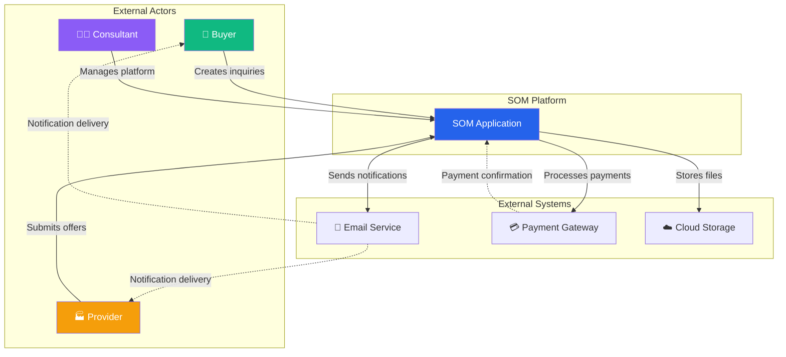
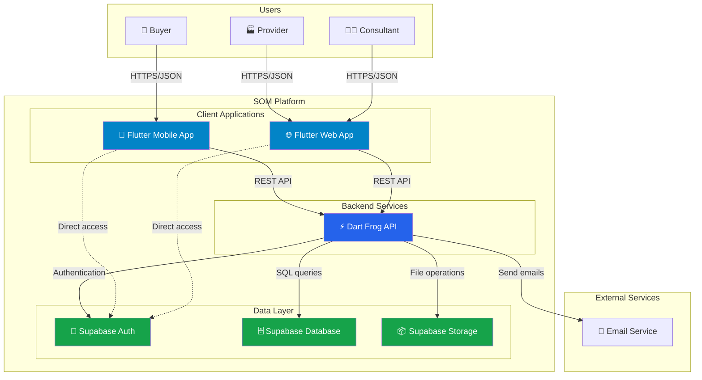
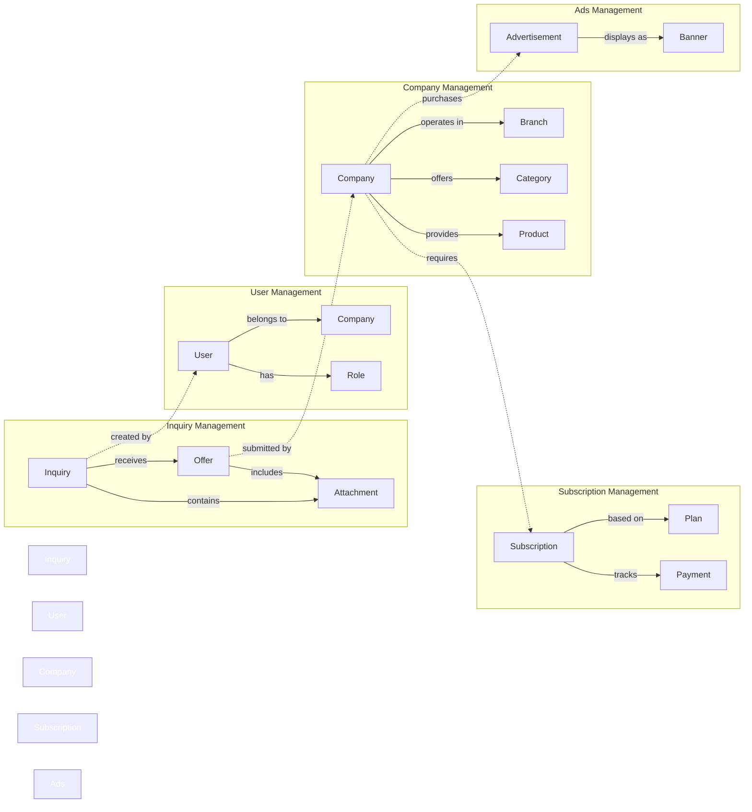
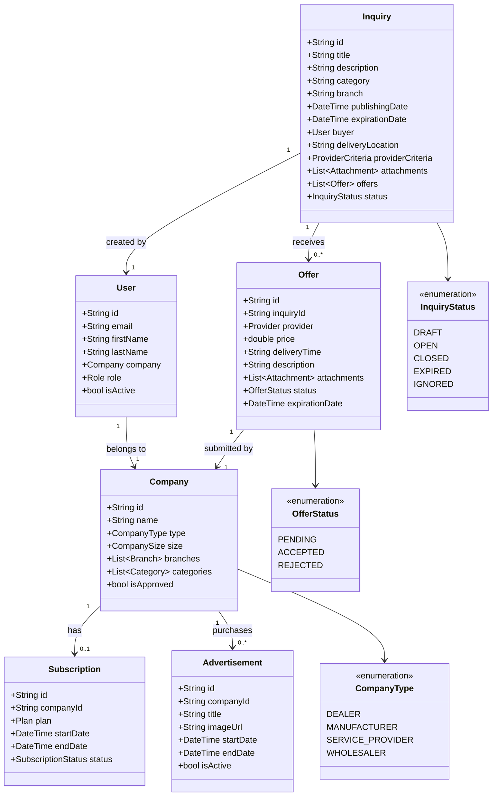
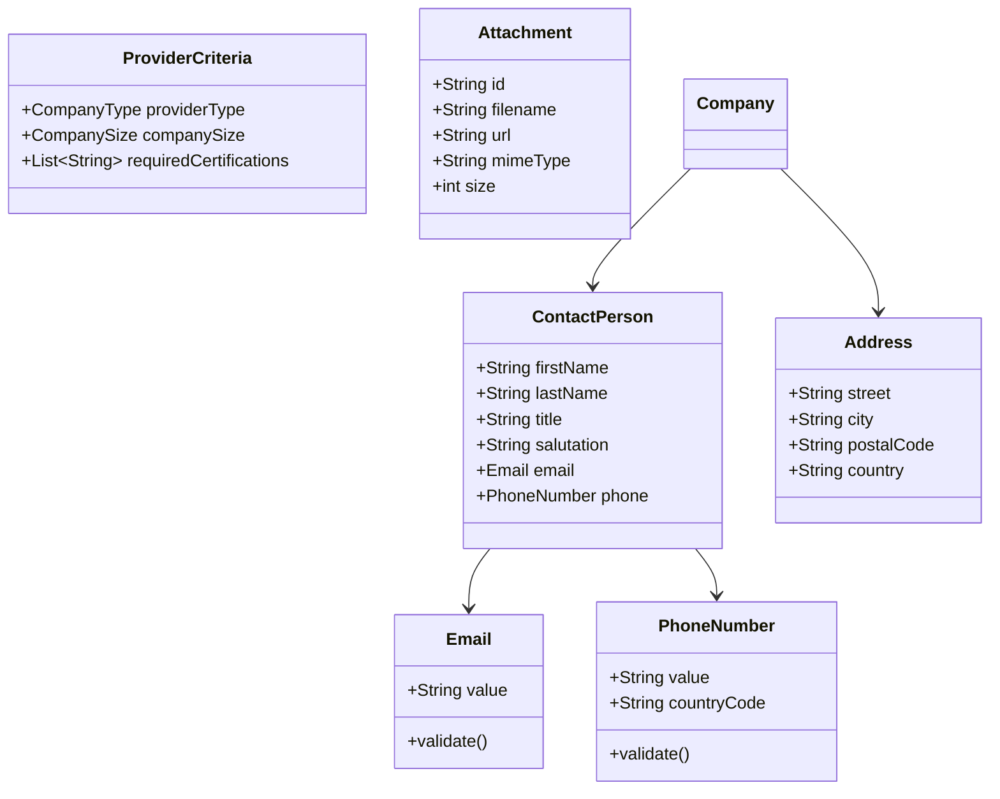
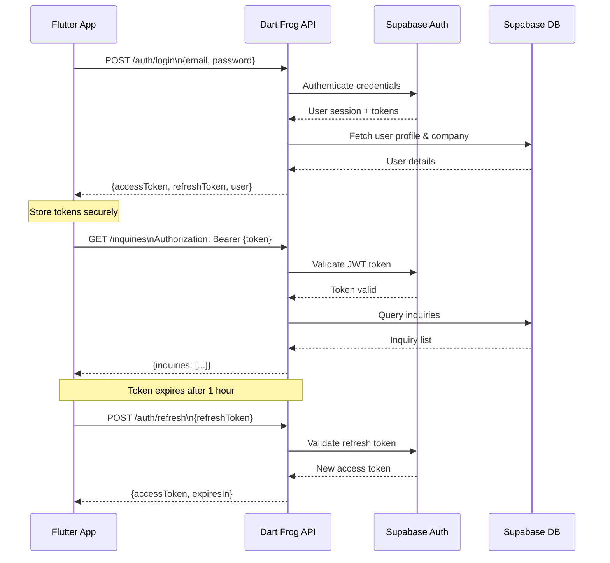
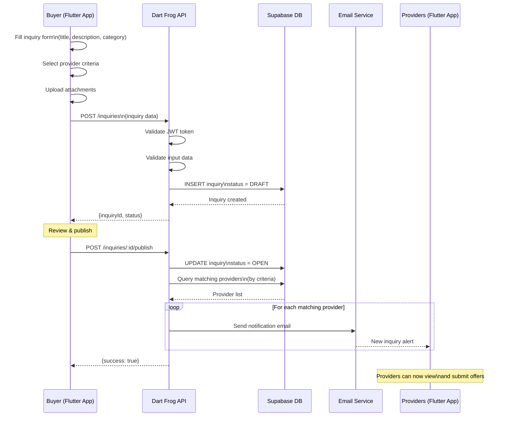
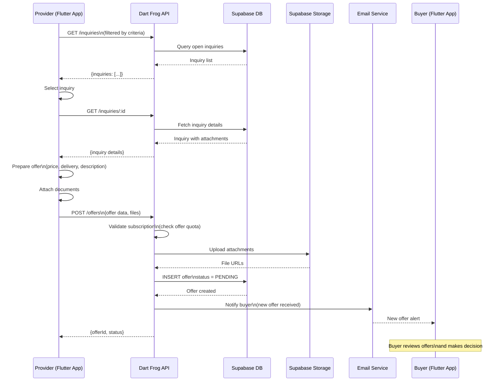
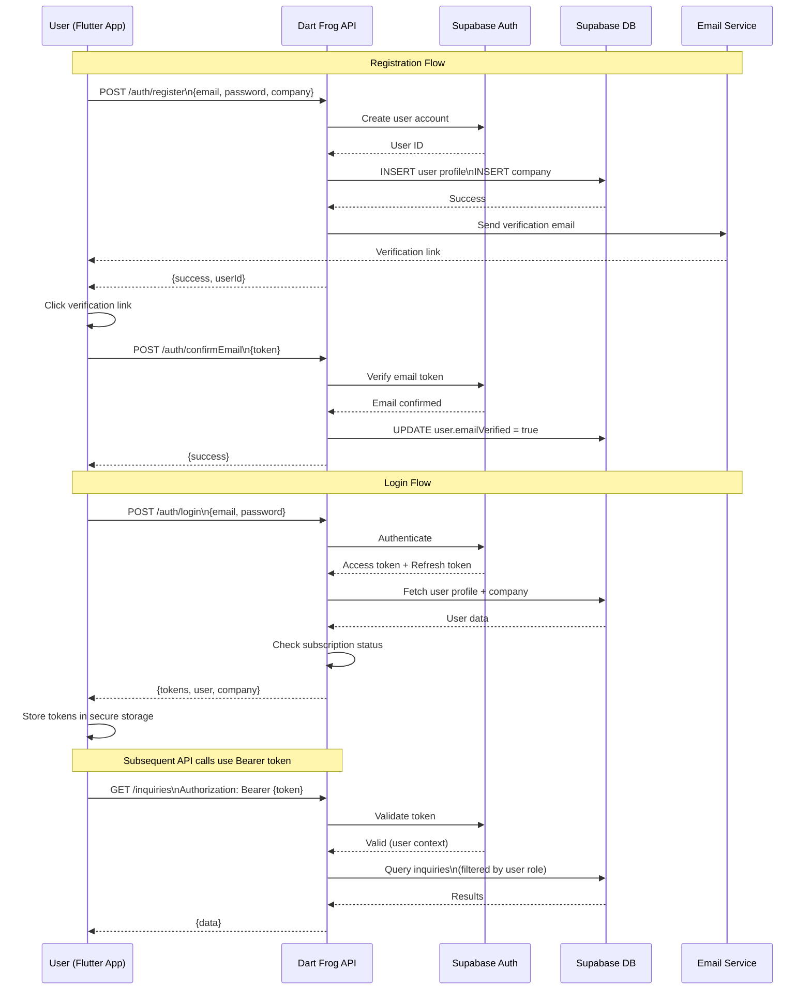
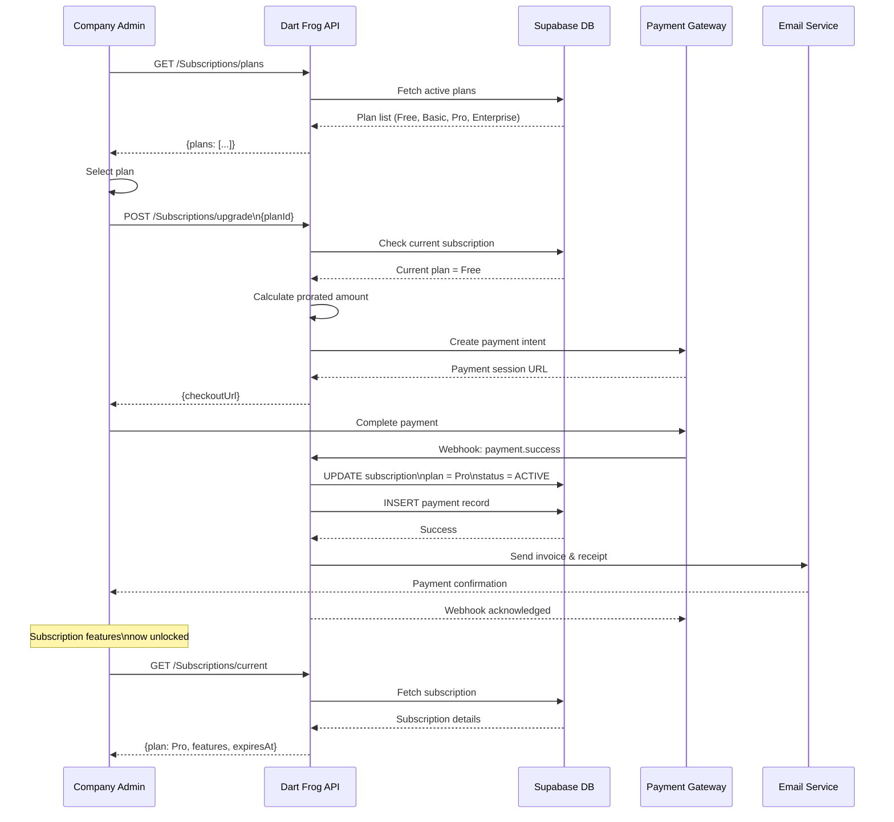

# SOM Architecture Documentation

**Smart Offer Management (SOM)** - B2B Marketplace Platform

## Table of Contents

1. [System Overview](#system-overview)
2. [System Context (C4 Level 1)](#system-context-c4-level-1)
3. [Container Architecture (C4 Level 2)](#container-architecture-c4-level-2)
4. [Domain Model](#domain-model)
5. [API Architecture](#api-architecture)
6. [Data Flow Diagrams](#data-flow-diagrams)
7. [Technology Stack](#technology-stack)
8. [Directory Structure](#directory-structure)
9. [Design Decisions & Trade-offs](#design-decisions--trade-offs)
10. [Related Documentation](#related-documentation)

---

## System Overview

**SOM (Smart Offer Management)** is a B2B marketplace platform that connects buyers with providers through a streamlined inquiry and offer process, managed by consultants.

### Core Business Process

1. **Buyers** create inquiries describing their needs
2. **Providers** submit competitive offers in response to inquiries
3. **Consultants** manage the platform, approve providers, and facilitate transactions

### Key Features

- Multi-tenant company management
- Inquiry lifecycle management (draft → published → closed)
- Offer submission and evaluation workflow
- Subscription-based access control
- Advertisement management for providers
- Audit logging and compliance tracking
- Real-time notifications and email integration

---

## System Context (C4 Level 1)



---

## Container Architecture (C4 Level 2)



---

## Domain Model

### Bounded Contexts



### Core Domain Entities



### Value Objects



---

## API Architecture

### Endpoint Structure

```mermaid
graph TB
    subgraph API Routes /api/
        Auth[/auth]
        Inquiries[/inquiries]
        Offers[/offers]
        Companies[/Companies]
        Providers[/providers]
        Subscriptions[/Subscriptions]
        Ads[/ads]
        Branches[/branches]
        Categories[/categories]
        Users[/Users]
        Roles[/roles]
        Billing[/billing]
        Audit[/audit]
        Stats[/stats]
        Health[/health]
    end

    Auth -.->|JWT tokens| Inquiries
    Auth -.->|JWT tokens| Offers
    Auth -.->|JWT tokens| Companies

    Inquiries -->|references| Categories
    Inquiries -->|references| Branches
    Offers -->|belongs to| Inquiries
    Providers -->|type of| Companies
    Companies -->|requires| Subscriptions
    Companies -->|purchases| Ads

    style Auth fill:#dc2626,color:#fff
    style Inquiries fill:#2563eb,color:#fff
    style Offers fill:#2563eb,color:#fff
    style Companies fill:#16a34a,color:#fff
```

### Authentication Flow



### Request/Response Patterns

**Standard Response Envelope:**

```json
{
  "success": true,
  "data": { ... },
  "meta": {
    "timestamp": "2026-01-22T10:30:00Z",
    "pagination": {
      "page": 1,
      "limit": 20,
      "total": 150
    }
  }
}
```

**Error Response:**

```json
{
  "success": false,
  "error": {
    "code": "VALIDATION_ERROR",
    "message": "Invalid input data",
    "details": {
      "email": "Invalid email format"
    }
  },
  "meta": {
    "timestamp": "2026-01-22T10:30:00Z"
  }
}
```

### Key API Endpoints

| Method | Endpoint | Description |
|--------|----------|-------------|
| **Authentication** |
| POST | `/auth/login` | User login |
| POST | `/auth/logout` | User logout |
| POST | `/auth/forgotPassword` | Password reset request |
| POST | `/auth/resetPassword` | Reset password with token |
| POST | `/auth/changePassword` | Change password (authenticated) |
| POST | `/auth/confirmEmail` | Email verification |
| **Inquiries** |
| GET | `/inquiries` | List all inquiries |
| POST | `/inquiries` | Create new inquiry |
| GET | `/inquiries/:id` | Get inquiry details |
| PUT | `/inquiries/:id` | Update inquiry |
| DELETE | `/inquiries/:id` | Delete inquiry |
| POST | `/inquiries/:id/assign` | Assign inquiry to provider |
| POST | `/inquiries/:id/close` | Close inquiry |
| POST | `/inquiries/:id/ignore` | Ignore inquiry |
| **Offers** |
| GET | `/offers` | List all offers |
| POST | `/offers` | Submit new offer |
| GET | `/offers/:id` | Get offer details |
| POST | `/offers/:id/accept` | Accept offer |
| POST | `/offers/:id/reject` | Reject offer |
| **Companies** |
| GET | `/Companies` | List companies |
| POST | `/Companies` | Create company |
| GET | `/Companies/:id` | Get company details |
| PUT | `/Companies/:id` | Update company |
| POST | `/Companies/:id/activate` | Activate company |
| **Providers** |
| GET | `/providers/:id` | Get provider details |
| POST | `/providers/:id/approve` | Approve provider (consultant) |
| POST | `/providers/:id/decline` | Decline provider (consultant) |
| GET | `/providers/:id/products` | List provider products |
| POST | `/providers/:id/products` | Add product |
| PUT | `/providers/:id/paymentDetails` | Update payment details |
| POST | `/providers/:id/taxonomy` | Update taxonomy mapping |
| **Subscriptions** |
| GET | `/Subscriptions` | List subscription plans |
| GET | `/Subscriptions/current` | Get current subscription |
| POST | `/Subscriptions/upgrade` | Upgrade subscription |
| POST | `/Subscriptions/downgrade` | Downgrade subscription |
| POST | `/Subscriptions/cancel` | Cancel subscription |
| GET | `/Subscriptions/plans/:id` | Get plan details |
| **Advertisements** |
| GET | `/ads` | List advertisements |
| POST | `/ads` | Create advertisement |
| GET | `/ads/:id` | Get ad details |
| PUT | `/ads/:id` | Update advertisement |
| POST | `/ads/:id/activate` | Activate ad |
| POST | `/ads/:id/deactivate` | Deactivate ad |
| GET | `/ads/:id/image` | Get ad image |
| **Other** |
| GET | `/branches` | List industry branches |
| GET | `/categories` | List product categories |
| GET | `/roles` | List user roles |
| GET | `/billing` | List invoices |
| GET | `/audit` | Get audit logs (consultant) |
| GET | `/stats` | Platform statistics |
| GET | `/health` | Health check |

---

## Data Flow Diagrams

### Inquiry Creation Flow



### Offer Submission Flow



### User Authentication Flow



### Subscription Management Flow



---

## Technology Stack

### Frontend (Flutter)

| Technology | Purpose | Version |
|------------|---------|---------|
| **Flutter** | Cross-platform UI framework | SDK 3.8.0+ |
| **Dart** | Programming language | 3.8.0+ |
| **MobX** | State management | 2.6.0 |
| **flutter_mobx** | MobX Flutter bindings | 2.3.0 |
| **Provider** | Dependency injection | 6.1.5 |
| **Beamer** | Declarative routing | 1.7.0 |
| **Chopper** | HTTP client generator | 8.5.0 |
| **Dio** | HTTP client | 5.9.0 |
| **supabase_flutter** | Supabase client SDK | 2.12.0 |
| **json_annotation** | JSON serialization annotations | 4.9.0 |
| **freezed_annotation** | Immutable data classes | 3.1.0 |
| **fpdart** | Functional programming (Either, Option) | 1.2.0 |
| **shared_preferences** | Local key-value storage | 2.5.4 |
| **cached_network_image** | Image caching | 3.4.1 |
| **file_picker** | File upload widget | 10.3.8 |
| **intl** | Internationalization | 0.20.2 |
| **flutter_localizations** | Built-in i18n | SDK |
| **google_maps_flutter** | Map integration | 2.14.0 |
| **url_launcher** | External URLs | 6.3.2 |
| **logger** | Logging | 2.6.2 |

### Backend (Dart Frog)

| Technology | Purpose | Version |
|------------|---------|---------|
| **Dart Frog** | Fast, lightweight HTTP server | 1.1.0 |
| **Dart** | Programming language | 3.5.0+ |
| **dart_jsonwebtoken** | JWT authentication | 3.3.1 |
| **supabase** | Supabase client SDK | 2.5.6 |
| **mailer** | Email sending | 6.6.0 |
| **uuid** | UUID generation | 4.4.0 |
| **crypto** | Cryptographic operations | 3.0.3 |
| **logging** | Structured logging | 1.2.0 |
| **intl** | Date/time formatting | 0.20.2 |
| **mime** | MIME type detection | 2.0.0 |
| **pdf** | PDF generation | 3.11.3 |

### Database & Backend Services (Supabase)

| Technology | Purpose |
|------------|---------|
| **PostgreSQL** | Relational database (14.x) |
| **Supabase Auth** | Authentication & authorization |
| **Supabase Storage** | Object storage for files |
| **Supabase Realtime** | WebSocket subscriptions |
| **PostgREST** | Auto-generated REST API |

### Domain Modeling (EDNet)

| Technology | Purpose | Version |
|------------|---------|---------|
| **ednet_core** | Event-driven domain modeling | Local path |
| **som_manager** | Generated domain code | Local path |

### DevOps & Tooling

| Technology | Purpose |
|------------|---------|
| **build_runner** | Code generation runner |
| **json_serializable** | JSON serialization generator |
| **mobx_codegen** | MobX code generator |
| **chopper_generator** | HTTP client generator |
| **flutter_lints** | Dart linting rules |
| **dart_frog_test** | API testing framework |

---

## Directory Structure

```
som-app/
├── api/                          # Dart Frog Backend API
│   ├── routes/                   # API endpoints (file-based routing)
│   │   ├── ads/                  # Advertisement management
│   │   ├── auth/                 # Authentication endpoints
│   │   │   ├── login.dart
│   │   │   ├── logout.dart
│   │   │   ├── forgotPassword.dart
│   │   │   └── confirmEmail.dart
│   │   ├── billing/              # Invoice management
│   │   ├── branches/             # Industry branches
│   │   ├── categories/           # Product categories
│   │   ├── Companies/            # Company management
│   │   │   ├── [companyId]/
│   │   │   │   ├── users/        # Company users
│   │   │   │   └── activate.dart
│   │   │   └── index.dart
│   │   ├── consultants/          # Consultant operations
│   │   ├── inquiries/            # Inquiry management
│   │   │   ├── [inquiryId]/
│   │   │   │   ├── assign.dart
│   │   │   │   ├── close.dart
│   │   │   │   └── ignore.dart
│   │   │   └── index.dart
│   │   ├── offers/               # Offer management
│   │   │   └── [offerId]/
│   │   │       ├── accept.dart
│   │   │       └── reject.dart
│   │   ├── providers/            # Provider operations
│   │   │   └── [companyId]/
│   │   │       ├── products/
│   │   │       ├── approve.dart
│   │   │       ├── decline.dart
│   │   │       ├── paymentDetails.dart
│   │   │       └── taxonomy.dart
│   │   ├── Subscriptions/        # Subscription billing
│   │   │   ├── plans/
│   │   │   ├── current.dart
│   │   │   ├── upgrade.dart
│   │   │   ├── downgrade.dart
│   │   │   └── cancel.dart
│   │   ├── roles/                # Role management
│   │   ├── Users/                # User management
│   │   ├── audit/                # Audit logs
│   │   ├── stats/                # Statistics
│   │   └── health/               # Health checks
│   ├── lib/                      # Shared backend code
│   ├── test/                     # API tests
│   └── pubspec.yaml
│
├── lib/                          # Flutter Application
│   ├── application/              # Application layer (use cases)
│   │   └── inquiry/
│   ├── domain/                   # Domain layer (business logic)
│   │   ├── model/                # Domain models
│   │   │   ├── inquiry_management/
│   │   │   │   ├── inquiry.dart
│   │   │   │   ├── offer.dart
│   │   │   │   ├── user.dart
│   │   │   │   ├── company.dart
│   │   │   │   ├── attachment.dart
│   │   │   │   ├── provider.dart
│   │   │   │   ├── buyer.dart
│   │   │   │   └── enums/
│   │   │   │       ├── inquiry_status.dart
│   │   │   │       ├── offer_status.dart
│   │   │   │       ├── company_role.dart
│   │   │   │       ├── company_size.dart
│   │   │   │       └── company_type.dart
│   │   │   ├── core/
│   │   │   │   └── entity.dart
│   │   │   └── functional/
│   │   │       └── functional.dart
│   │   ├── inquiry/              # Inquiry domain services
│   │   │   └── repositories/
│   │   │       └── i_inquiry_repository.dart
│   │   ├── advertisement/        # Advertisement domain
│   │   │   └── repositories/
│   │   │       └── i_ads_repository.dart
│   │   └── infrastructure/       # Infrastructure implementations
│   │       └── repository/
│   │           └── api/
│   │               ├── lib/
│   │               │   ├── login_service.dart
│   │               │   ├── subscription_service.dart
│   │               │   ├── api_subscription_repository.dart
│   │               │   └── models/
│   │               │       ├── auth/
│   │               │       ├── domain/
│   │               │       └── subscription.dart
│   │               └── utils/
│   │                   ├── converters/
│   │                   └── interceptors/
│   │                       ├── token_interceptor.dart
│   │                       ├── cors_interceptor.dart
│   │                       └── http_color_logging_interceptor.dart
│   ├── ui/                       # Presentation layer
│   │   ├── pages/                # Page widgets
│   │   ├── widgets/              # Reusable widgets
│   │   ├── domain/               # UI-specific domain
│   │   │   └── model/
│   │   │       └── cards/
│   │   ├── routes/               # Navigation routes
│   │   ├── theme/                # App theming
│   │   └── utils/                # UI utilities
│   ├── generated/                # EDNet generated code
│   │   ├── domain/
│   │   ├── lib/
│   │   └── pubspec.yaml
│   ├── infrastructure/           # Cross-cutting concerns
│   │   └── api/
│   ├── requirements/             # Requirements documentation
│   │   ├── inquiry/
│   │   └── offer/
│   ├── playground/               # Experimental code
│   │   └── domain_generator/
│   │       ├── annotations/
│   │       └── generators/
│   └── main.dart                 # Application entry point
│
├── supabase/                     # Database & migrations
│   ├── migrations/               # SQL migration files
│   │   ├── 20260115000000_init.sql
│   │   ├── 20260115001000_add_email_events.sql
│   │   ├── 20260115007000_add_domain_audit_schema.sql
│   │   ├── 20260118000000_add_taxonomy_mappings.sql
│   │   └── ...
│   └── config.toml
│
├── seed-data/                    # Data seeding utilities
│   └── etl/
│
├── openapi/                      # OpenAPI specifications
│   └── pubspec.yaml
│
├── docs/                         # Documentation
│   └── ARCHITECTURE.md           # This file
│
├── assets/                       # Static assets
│   └── design_system/
│       ├── ads/
│       ├── auth/
│       ├── inquiry/
│       ├── offers/
│       └── wizards/
│
├── images/                       # Image assets
│   └── som/
│       └── icons/
│
├── fonts/                        # Font files
│
├── lang/                         # Internationalization
│   ├── en.json
│   ├── de.json
│   └── sr.json
│
├── test/                         # Flutter tests
│   └── integration_test/         # E2E tests
│
├── pubspec.yaml                  # Flutter dependencies
├── README.md                     # Project overview
├── CLAUDE.md                     # Claude Code instructions
└── AGENTS.md                     # Agent guidance
```

---

## Design Decisions & Trade-offs

### 1. Monorepo Structure

**Decision:** Combine Flutter app, Dart Frog API, and Supabase migrations in a single repository.

**Rationale:**
- Shared domain models between frontend and backend (`som_manager`, `ednet_core`)
- Simplified dependency management
- Atomic commits for full-stack features
- Easier local development setup

**Trade-offs:**
- Larger repository size
- Potential for tighter coupling
- CI/CD complexity (need selective builds)

### 2. Flutter + Dart Frog Technology Stack

**Decision:** Use Flutter for frontend and Dart Frog for backend.

**Rationale:**
- Single language (Dart) across the stack
- Code sharing for domain models and DTOs
- Strong type safety end-to-end
- Fast development velocity
- Native mobile performance + web reach

**Trade-offs:**
- Smaller ecosystem compared to Node.js/Spring Boot
- Fewer third-party integrations
- Team needs Dart expertise

### 3. Supabase as Backend-as-a-Service

**Decision:** Use Supabase for authentication, database, storage, and real-time features.

**Rationale:**
- PostgreSQL with built-in row-level security (RLS)
- Real-time subscriptions out of the box
- Managed authentication with JWT
- Object storage for attachments
- Auto-generated REST API (PostgREST) as fallback
- Open-source and self-hostable

**Trade-offs:**
- Vendor lock-in risk (mitigated by open-source nature)
- Learning curve for RLS policies
- Limited customization compared to custom backend

### 4. File-Based Routing (Dart Frog)

**Decision:** Use Dart Frog's file-based routing convention.

**Rationale:**
- Intuitive API structure (file path = URL path)
- Automatic route registration
- Clear separation of concerns per endpoint
- Dynamic routes via `[paramName]` convention

**Trade-offs:**
- Route organization can become complex with many endpoints
- Harder to apply middleware selectively

### 5. EDNet Domain Modeling

**Decision:** Use EDNet for event-driven domain modeling.

**Rationale:**
- Enforces domain-driven design (DDD) principles
- Generates boilerplate code
- Event sourcing capabilities for audit trails
- Bounded context separation

**Trade-offs:**
- Additional abstraction layer
- Generated code can be hard to debug
- Requires understanding of DDD concepts

### 6. MobX for State Management

**Decision:** Use MobX for reactive state management in Flutter.

**Rationale:**
- Minimal boilerplate compared to BLoC
- Automatic dependency tracking
- Observable stores align with domain models
- Code generation for computed values

**Trade-offs:**
- Less prescriptive than BLoC (potential for inconsistent patterns)
- Requires build_runner for code generation
- Smaller community compared to Riverpod/BLoC

### 7. JWT Authentication

**Decision:** Use JWT tokens for stateless authentication.

**Rationale:**
- Stateless (no server-side session storage)
- Works seamlessly with Supabase Auth
- Easy to validate in Dart Frog middleware
- Supports refresh tokens for security

**Trade-offs:**
- Cannot revoke tokens before expiration (need refresh token rotation)
- Larger payload size compared to session cookies
- Requires secure storage on client

### 8. Subscription-Based Access Control

**Decision:** Implement subscription tiers with feature flags.

**Rationale:**
- Revenue model for B2B marketplace
- Gradual feature unlock (freemium model)
- Flexible plan upgrades/downgrades
- Quota enforcement (e.g., max offers per month)

**Trade-offs:**
- Complexity in feature gating logic
- Requires payment gateway integration
- Subscription management overhead

### 9. Multi-Language Support

**Decision:** Support English, German, and Serbian via JSON files.

**Rationale:**
- Target European markets (DACH region + Balkans)
- JSON-based i18n is simple and tooling-friendly
- No external translation service dependencies

**Trade-offs:**
- Manual translation management
- Potential for inconsistencies across languages
- No context-aware translations (e.g., gender/pluralization)

### 10. Attachment Storage in Supabase Storage

**Decision:** Store inquiry/offer attachments in Supabase Storage instead of database BLOBs.

**Rationale:**
- Efficient CDN delivery
- Signed URLs for security
- Avoids database bloat
- Easy integration with Flutter file_picker

**Trade-offs:**
- Additional service dependency
- Storage costs scale with file count
- Orphaned files if not cleaned up properly

---

## Related Documentation

### Internal Documentation

- **[README.md](../README.md)** - Project overview and setup instructions
- **[CLAUDE.md](../CLAUDE.md)** - Claude Code-specific guidance
- **[AGENTS.md](../AGENTS.md)** - Universal agent guidance and protocols
- **[cms/CLAUDE.md](../../cms/CLAUDE.md)** - CMS-specific workflow commands

### Domain Model Documentation

- **[lib/requirements/inquiry/](../lib/requirements/inquiry/)** - Inquiry management requirements
- **[lib/requirements/offer/](../lib/requirements/offer/)** - Offer management requirements
- **[lib/generated/doc/](../lib/generated/doc/)** - EDNet generated domain documentation

### API Documentation

- **[openapi/](../openapi/)** - OpenAPI specification (if available)
- **API Endpoints:** See [API Architecture](#api-architecture) section above

### Database Documentation

- **[supabase/migrations/](../supabase/migrations/)** - SQL migration files with schema evolution
- **[supabase/config.toml](../supabase/config.toml)** - Supabase configuration

### External Resources

- **[Flutter Documentation](https://docs.flutter.dev/)** - Official Flutter framework docs
- **[Dart Frog Documentation](https://dartfrog.vgv.dev/)** - Dart Frog framework docs
- **[Supabase Documentation](https://supabase.com/docs)** - Supabase platform docs
- **[EDNet Core](https://github.com/ednet-dev/ednet_core)** - EDNet domain modeling library
- **[MobX for Dart](https://pub.dev/packages/mobx)** - MobX state management

---

## Version History

| Version | Date | Author | Changes |
|---------|------|--------|---------|
| 1.0.0 | 2026-01-22 | Claude Code | Initial architecture documentation |

---

**Last Updated:** 2026-01-22
